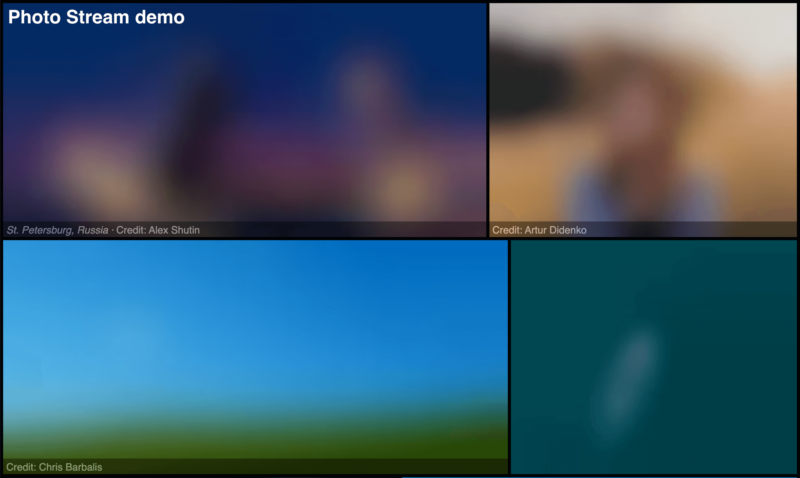
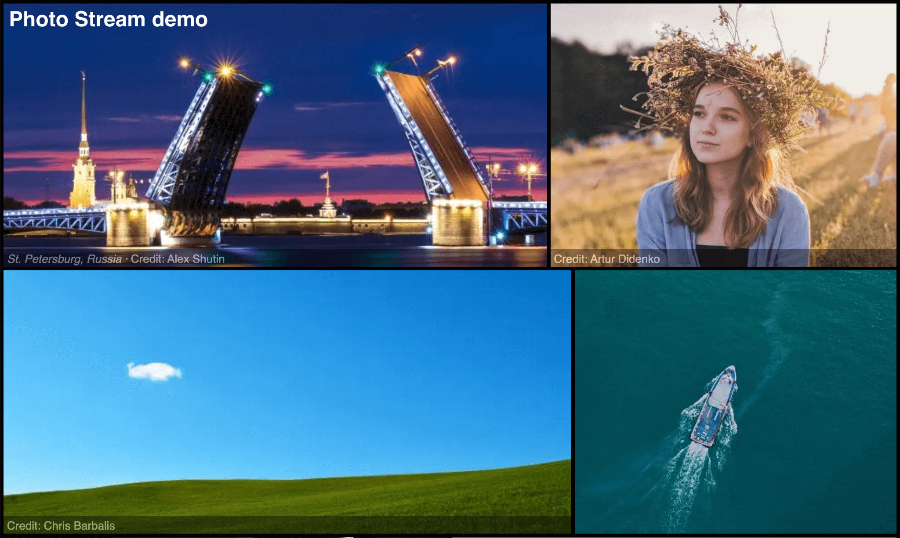

### Fonctionnalités

#### Filtre LQIP

Le filtre Twig `lqip` renvoie un [espace réservé pour une image de faible qualité](https://www.guypo.com/introducing-lqip-low-quality-image-placeholders) (LQIP) comme URL de données.

```twig
{{ asset(image_path)|lqip }}
```

[Documentation →](/documentation/templates/#lqip)

_Exemple:_

```html


<div style="background-image:url({{ photo|lqip }});background-repeat:no-repeat;background-position:center;background-size:cover;">
  <a href="{{ url(photo_full) }}">{{ photo|html }}</a>
</div>
```

_Exemple de chargement progressif de [galerie d'images](https://photo-stream-demo.cecil.app/) :_





### Documents

- Configuration _imgix_ CDN ajoutée

### Divers

- Dépendances mises à jour
- Meilleure gestion des images