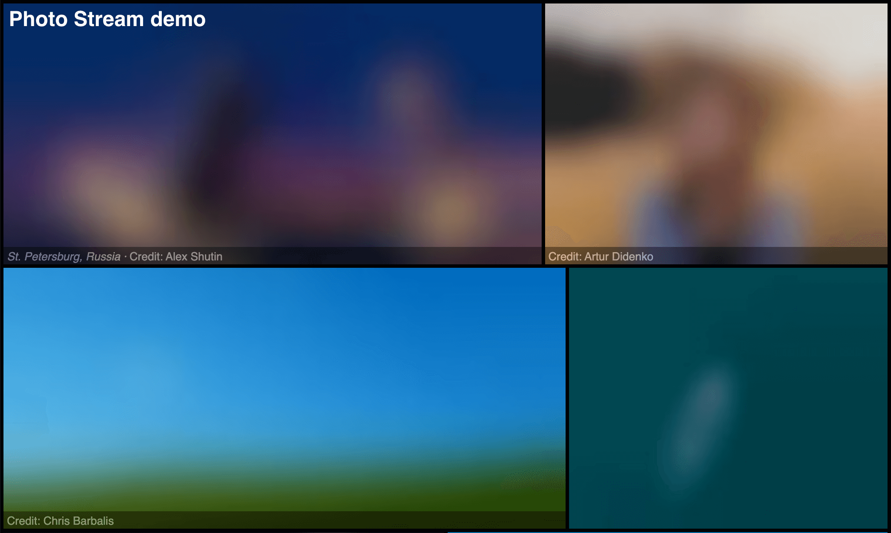
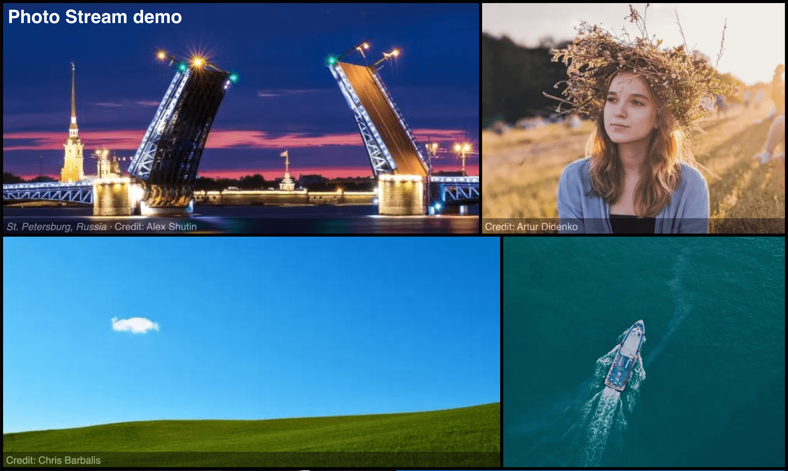

### Features

#### LQIP filter

The Twig filter `lqip` returns a [Low Quality Image Placeholder](https://www.guypo.com/introducing-lqip-low-quality-image-placeholders) (LQIP) as data URL.

```twig
{{ asset(image_path)|lqip }}
```

[Documentation →](/documentation/templates/#lqip)

_Example:_

```html


<div style="background-image:url({{ photo|lqip }});background-repeat:no-repeat;background-position:center;background-size:cover;">
  <a href="{{ url(photo_full) }}">{{ photo|html() }}</a>
</div>
```

_Example of progressive loading of images gallery:_





### Docs

- _imgix_ CDN configuration added

### Miscs

- Dependencies updated
- Better image handling